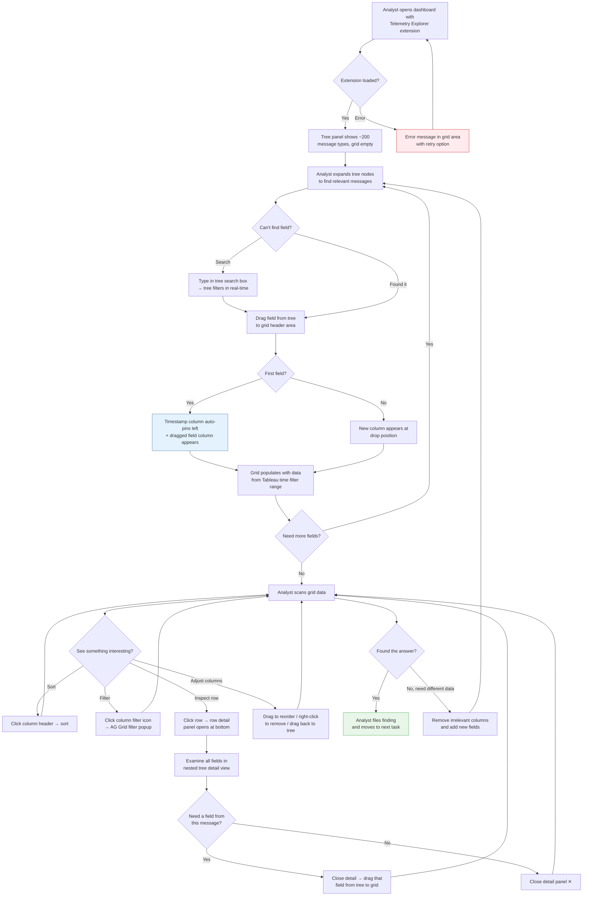
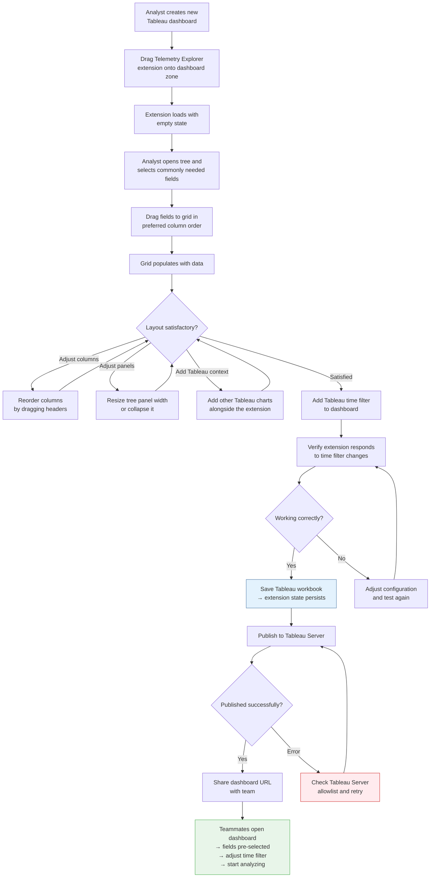

# UX Design Specification TableauPlugin

**Author:** Rgamz
**Date:** 2026-04-03

---

<!-- UX design content will be appended sequentially through collaborative workflow steps -->

## Executive Summary

### Project Vision

Tableau Dashboard Extension (React SPA, iframe) providing aerospace/defense telemetry analysts with a purpose-built data exploration tool. V1 delivers tree-based field selection across ~200 nested message types, a mixed-line sparse grid (AG Grid) interleaving multiple message types by time, row detail inspection, and 10-second live data refresh — all within Tableau's filter and authentication framework. Air-gapped on-prem deployment.

### Target Users

**Primary: Telemetry Analysts** — Technically proficient engineers and analysts with deep domain knowledge of telemetry, sensor data, and communications logs. Daily users who understand message structures and field semantics. Frustrated by current flat-list tooling and multi-tool workflows. Examine 1K-35K messages per session across ~200 message types with up to 6 levels of nesting.

**Secondary: IT/Data Team** — Deploy and maintain the extension on Tableau Server. Minimal UX surface — deployment process, allowlisting, and version updates.

### Key Design Challenges

1. **Tree selector scalability** — Thousands of potential nodes across ~200 message types. Must support efficient navigation, search/filter, clear selection state, and not overwhelm the analyst.
2. **Mixed-line sparse grid readability** — Interleaved rows from different message types with mostly-blank cells. Must enable visual distinction between row types and pattern recognition.
3. **Live refresh without disruption** — 10-second polling with new data insertion. Must preserve scroll position, filter/sort state, and analyst focus.
4. **Row detail context retention** — Inspecting all fields of a single message while maintaining grid context. Interaction pattern (modal, panel, drawer) must balance detail visibility with grid awareness.
5. **Constrained screen real estate** — Extension runs in a Tableau dashboard zone (iframe). Tree selector and grid compete for space. Collapsibility required.

### Design Opportunities

1. **Tree selector as hero interaction** — First-class nested message model comes alive here. Search, multi-select, and clear hierarchy create the differentiating "aha moment."
2. **Row-type visual encoding** — Color-coding or visual markers for message types make the sparse grid instantly scannable.
3. **Smooth live refresh** — Subtle animations and count indicators can make live data feel like a feature, not a disruption.

## Core User Experience

### Defining Experience

The core interaction loop is: **browse tree → drag fields to grid → scan data → inspect details → refine selection.** This cycle repeats throughout every analysis session. The drag-and-drop from tree to grid is the hero interaction — the moment the product's value becomes tangible.

**Core loop:**
1. Analyst browses or searches the tree selector to find relevant message types and fields
2. Analyst drags individual fields from the tree into the grid — each field becomes a column at the drop position
3. Grid immediately populates with data for all selected fields, interleaved by time
4. Analyst scans, filters, sorts, and clicks rows to inspect details
5. Analyst refines by adding more fields, removing others, or reordering columns

### Platform Strategy

- **Platform:** Tableau Dashboard Extension (React SPA in iframe)
- **Input:** Mouse/keyboard only — Tableau Desktop and Server (Chrome browser)
- **No mobile/tablet, no touch, no offline requirements**
- **Screen real estate:** constrained by Tableau dashboard zone size; tree selector and grid compete for horizontal space
- **Drag-and-drop:** primary interaction pattern for field selection — must work smoothly within the iframe constraints of the Tableau Extensions API

### Effortless Interactions

**Field selection (drag-and-drop) must feel instant and direct:**
- Drag from tree → column appears in grid at the drop position immediately
- No "apply" button, no intermediate state — drag is the action
- Multiple fields can be dragged in rapid succession
- Tree search/filter narrows the tree so the analyst can find fields fast

**Column management must be friction-free:**
- Timestamp column is always pinned first — always present, not removable, not reorderable
- All other columns can be reordered by dragging within the grid header
- Fields can be removed three ways: drag column back to tree, right-click column → remove, or uncheck the field in the tree
- Tree selection state and grid column state stay in sync at all times

**Grid scanning should require zero configuration:**
- Mixed-line rows are visually distinguished by message type (color coding or row markers)
- Virtual scrolling is seamless — no perceptible loading or stuttering
- Live refresh (10s) inserts new rows without disrupting the analyst's current view

### Critical Success Moments

1. **First drag** — Analyst drags a field from the tree to the grid and sees data appear instantly. This is the "aha moment" that proves the tool works.
2. **First multi-message view** — Analyst drags fields from 3 different message types and sees them interleaved by time in one grid. This is impossible in native Tableau.
3. **First row inspection** — Analyst clicks a row and sees the full nested message structure in a detail tree. The depth of the data becomes visible.
4. **First live refresh** — New data appears in the grid without losing scroll position or focus. The analyst realizes the data is alive.

### Experience Principles

1. **Drag is the action** — No intermediate steps between intent and result. Dragging a field to the grid immediately produces a visible column with data. The extension responds to direct manipulation, not form submission.
2. **Tree and grid are one system** — Selection state is always synchronized. Any change in the tree reflects in the grid and vice versa. They are two views of the same selection, not two separate controls.
3. **Timestamp is the anchor** — Time-ordering is the fundamental axis. Timestamp is always present, always first, always sorted. Everything else is relative to time.
4. **Data appears, never disappears unexpectedly** — Live refresh adds data; it never removes rows the analyst is looking at. Filter/sort state is preserved across refreshes. The analyst's view is stable unless they choose to change it.

## Desired Emotional Response

### Primary Emotional Goals

**In control and efficient.** Expert analysts doing serious investigative work. The tool should feel like an extension of their thinking — responsive, predictable, and invisible when it's working well. The target feeling: *"I can see exactly what I need, exactly when I need it."*

### Emotional Journey Mapping

| Stage | Desired Emotion | Design Implication |
|-------|----------------|-------------------|
| First use | Confidence — "I can see how this works" | Self-evident drag-and-drop interaction, no tutorial needed |
| Field selection | Mastery — "I know where everything is" | Tree hierarchy matches analysts' mental model of message structure |
| During analysis | Focus and flow — tool disappears, data is foreground | Minimal UI chrome, high data density, no unnecessary decoration |
| Finding an answer | Accomplishment — "I got this done myself, fast" | Fast performance reinforces capability; no dependencies on others |
| Error states | Trust — "My work is safe" | Clear error messages, data preserved, graceful degradation |
| Returning | Familiarity — "Everything is where I left it" | Saved state restores exactly; no re-configuration on reopen |

### Micro-Emotions

**Prioritized emotional states:**
- **Confidence over confusion** — tree structure, drag feedback, and grid response must always communicate what's happening and what will happen next
- **Trust over skepticism** — data accuracy, live refresh transparency, and predictable behavior build trust over time
- **Accomplishment over frustration** — performance targets are emotional targets; any perceived lag breaks the flow state

### Design Implications

| Emotional Goal | UX Approach |
|---------------|------------|
| In control | Direct manipulation (drag-and-drop), immediate feedback, no modal dialogs blocking workflow |
| Efficient | Keyboard shortcuts for power users, minimal clicks to accomplish core tasks, remembered state |
| Focused | High data-to-chrome ratio, muted UI colors, data gets visual prominence |
| Trusting | Visible refresh indicator, preserved scroll/filter state, clear sync between tree and grid |
| Not overwhelmed | Tree search/filter to narrow scope, collapsible panel, progressive disclosure of detail |

### Emotional Design Principles

1. **Expert tool, not consumer app** — No onboarding wizards, no tooltips on hover, no gamification. Respect the analyst's expertise. The interface should feel like a professional instrument.
2. **Data is the hero** — Every pixel of UI chrome that isn't data should justify its existence. The grid and its contents are the primary visual element.
3. **Predictability over surprise** — Analysts investigating anomalies need a stable foundation. The tool must behave identically every time. No clever animations, no changing layouts, no "smart" rearrangements.
4. **Silence means success** — When everything is working, the UI should be quiet. Notifications and indicators only when something needs attention (new data arrived, error occurred).

## UX Pattern Analysis & Inspiration

### Inspiring Products Analysis

**VS Code / JetBrains IDEs**
- File explorer tree + editor panel layout is the closest analog to our tree selector + grid layout
- Collapsible side panel maximizes working area — exactly our space constraint solution
- Drag from explorer to editor tabs is a proven interaction pattern
- Power-user keyboard shortcuts layer on top of mouse interactions without cluttering the UI

**Wireshark**
- Closest domain analog: list of protocol messages, click to see nested field detail tree
- Three-panel layout: packet list (our grid), packet detail (our row detail tree), raw data
- Extremely high data density — expert users tolerate and prefer dense displays
- Handles thousands of packets with virtual scrolling

**Grafana / Kibana**
- Time-series data exploration with field selectors and query builders
- Live data refresh patterns — how they indicate new data without disrupting analysis
- Time filter as the primary navigation axis — matches our Tableau time filter handoff
- Field/metric selection patterns for large schemas

**AG Grid (native patterns)**
- Column drag reorder within grid header — use natively, don't reinvent
- Virtual scrolling for large datasets — built-in, proven at scale
- Column pinning (timestamp always first) — native AG Grid feature
- Filter/sort UI built into column headers — familiar to data tool users

### Transferable UX Patterns

**Navigation: VS Code split-panel layout**
- Left panel: tree selector (collapsible)
- Main panel: AG Grid
- Bottom or right panel: row detail tree (collapsible/toggleable)
- Resize handles between panels

**Interaction: Drag-and-drop field placement**
- Drag from tree → drop on grid header area → column appears at drop position
- Visual drop indicator (insertion line between columns) during drag
- Ghost preview of column header during drag for spatial feedback

**Data density: Wireshark-style detail tree**
- Row detail as expandable tree matching the nested message structure
- Field name on left, value on right — clean two-column layout
- Expand/collapse with triangle indicators (standard tree control)

**Live refresh: Grafana-style indicators**
- Small badge or counter showing "X new rows" rather than silently inserting
- Optional: subtle highlight on newly inserted rows that fades after a few seconds
- Refresh cycle indicator (spinning dot or pulse) in the status area

**Grid readability: Row-type color bands**
- Subtle left-edge color stripe per message type (like Wireshark protocol coloring)
- Color legend in a compact bar above or below the grid
- Muted colors — visual encoding, not decoration

### Anti-Patterns to Avoid

- **Modal dialogs for field selection** — blocks workflow, breaks direct manipulation principle. Tree selector must be always-visible (or one-click toggle), never a modal popup.
- **"Apply" buttons after configuration** — drag is the action. No intermediate state requiring confirmation.
- **Consumer-style onboarding** — no step-by-step wizards, no tooltips, no "did you know?" popups. Expert users find these patronizing.
- **Auto-hiding UI elements** — panels should be explicitly collapsible, not auto-hide on hover. Analysts need predictable, stable layouts.
- **Flashy animations on data updates** — live refresh should be subtle. No row-slide-in animations, no screen-flash on new data. Subtle highlight that fades, at most.
- **Dense configuration forms** — field selection happens via drag, not through settings panels with checkboxes and dropdowns.

### Design Inspiration Strategy

**Adopt directly:**
- AG Grid native column drag reorder, virtual scrolling, column pinning, header filters
- VS Code collapsible panel layout with resize handles
- Wireshark two-column tree layout for row detail (name | value)

**Adapt to our context:**
- VS Code file explorer → tree selector with message-type grouping and search/filter
- Grafana live refresh indicators → scaled to 10-second cycle with row count badge
- Wireshark protocol coloring → message-type color stripes on grid row edges

**Avoid entirely:**
- Consumer onboarding patterns (wizards, tooltips, gamification)
- Modal/dialog-based configuration
- Auto-hiding or auto-collapsing panels
- Animated data transitions

## Design System Foundation

### Design System Choice

**AG Grid Enterprise Theme + MUI (Material UI)** — a two-layer approach where AG Grid's theming governs the dominant grid component and MUI provides the supporting React components.

### Rationale for Selection

- AG Grid occupies ~70-80% of the visible UI — its theme defines the visual identity by default
- MUI provides production-ready React components for everything else: tree view, search input, buttons, icon buttons, context menus, drawer/panel, tooltips, status indicators
- Both are well-maintained, widely adopted, and bundle-friendly (air-gapped compatible)
- No custom design system needed for an internal expert tool — development speed over visual uniqueness
- MUI's theming engine can be configured to match AG Grid's visual language (fonts, colors, spacing)

### Implementation Approach

**AG Grid theming:**
- Start with AG Grid's Balham or Alpine theme (professional, data-dense)
- Customize colors and fonts to create a cohesive look
- AG Grid theme tokens become the source of truth for the visual language

**MUI theming:**
- Configure MUI's `createTheme` to match AG Grid's color palette, typography, and spacing
- One shared set of design tokens (colors, font sizes, border radii) that feeds both AG Grid and MUI
- Dark/light mode: defer to V2 unless Tableau dashboard theme can be detected

**Key MUI components to use:**
- `TreeView` — field/message selector
- `TextField` with search icon — tree filter/search
- `Drawer` or panel — row detail tree view
- `IconButton` — collapse/expand panel toggles
- `Menu` / `ContextMenu` — right-click column actions (remove field, etc.)
- `Chip` or `Badge` — message type indicators, new row count
- `Tooltip` — full dotted path on column headers

### Customization Strategy

- **Design tokens first:** Define a shared token file (colors, spacing, typography) that AG Grid and MUI both consume
- **Minimal custom CSS:** Leverage AG Grid and MUI built-in styling APIs; avoid custom CSS overrides unless absolutely necessary
- **Tableau visual harmony:** Match Tableau's neutral color palette (grays, blues) so the extension feels native to the dashboard environment
- **Message-type color palette:** Define a set of 8-10 muted, distinguishable colors for row-type color stripes. Must be accessible against both white and light gray backgrounds.

## Detailed Core Experience

### Defining Experience

**"Browse the tree, drag a field, see your data."**

The analyst drags fields from a hierarchical tree into the grid. Each drag immediately produces a new column with live data. No forms, no apply buttons, no waiting. The interaction is direct manipulation — intent maps to result with zero intermediate steps.

### User Mental Model

**How analysts think about this task today:**
- They know their message types by name and category (Navigation, Flight Control, Sensors, etc.)
- They think in terms of message hierarchies — "I need the altitude field inside the navigation GPS position message"
- They're accustomed to file-tree navigation (Windows Explorer, VS Code, Wireshark)
- They expect drag-and-drop to mean "put this thing there" — not "add this to a queue"

**Mental model we're matching:**
- Tree = the data catalog (all available messages and fields)
- Grid = the analyst's workspace (what they're currently looking at)
- Dragging = "I want to see this field" — placing it in the workspace
- Column position = the order I care about seeing things

**Where confusion could arise:**
- Mixed-line sparse model — analysts may not initially understand why most cells are blank. The row-type color stripe and a clear message-type column help orient them.
- Tree selection state vs. grid state — if an analyst unchecks a field in the tree, the column should disappear from the grid. This bidirectional sync must be instant and visible.

### Success Criteria

| Criteria | Indicator |
|----------|----------|
| Drag feels responsive | Column header appears at drop position within 100ms of release |
| Data appears fast | Column populates with data within the grid render time (< 5s for 10K rows) |
| Analyst stays oriented | Drop indicator (insertion line) shows exactly where the column will land during drag |
| Removal is obvious | Right-click → Remove, uncheck in tree, or drag back all work and are discoverable |
| Tree-grid sync is trustworthy | Selecting/deselecting in tree always matches grid columns — no drift, no stale state |
| First-time success | An analyst with no training can drag a field and see data within 30 seconds of opening the extension |

### Novel UX Patterns

**Combination of established patterns, not novel invention:**

| Pattern | Source | Adaptation |
|---------|--------|-----------|
| Tree navigation | VS Code file explorer, Windows Explorer | Message-type hierarchy with search/filter |
| Drag to workspace | VS Code drag file to editor, Tableau drag dimension to shelf | Drag field to grid column position |
| Column reorder | AG Grid native, Excel | Standard grid header drag |
| Pinned first column | AG Grid native, spreadsheets | Timestamp always pinned left |
| Row-type color stripe | Wireshark protocol coloring | Muted left-edge color per message type |
| Collapsible panel | VS Code sidebar | Tree selector panel with toggle button |
| Row detail tree | Wireshark packet detail pane | Nested field/value tree on row click |

**No novel patterns to teach.** Every interaction maps to something analysts already know. The innovation is in the combination and the domain-specific data model, not in new interaction paradigms.

### Experience Mechanics

**1. Initiation — Opening the extension:**
- Extension loads inside Tableau dashboard zone
- Tree selector panel is visible on the left (default state: expanded)
- Grid area shows empty state with a hint: "Drag fields from the tree to start exploring"
- Tableau's current time filter is already applied — the extension knows the time range

**2. Field Selection — Dragging fields:**
- Analyst expands tree nodes to find a message type (e.g., Navigation → GPS → Position)
- Analyst grabs a field node (e.g., `latitude`) and drags toward the grid
- During drag: ghost preview of the column header follows the cursor; insertion line appears between existing columns showing drop position
- On drop: column appears at the indicated position; grid begins populating with data
- Timestamp column is already present (pinned first) — it appeared automatically when the first field was dragged
- Analyst repeats for additional fields — each drag adds a column

**3. Feedback — During and after interaction:**
- Visual drop indicator during drag confirms "this will work"
- Column header appears instantly on drop (< 100ms)
- Data population happens within render target (< 5s for 10K rows)
- Tree node shows a "selected" indicator (checkmark or highlight) for fields currently in the grid
- Status bar shows row count: "10,247 rows | 3 message types | Last refresh: 2s ago"

**4. Refinement — Adjusting the view:**
- Reorder columns: drag column headers within the grid (AG Grid native)
- Remove a field: right-click column → Remove, or uncheck in tree, or drag column back to tree area
- Add more fields: drag from tree at any time — grid updates incrementally
- Filter: click column header filter icon (AG Grid native)
- Sort: click column header (AG Grid native)
- Inspect: click any row → row detail panel opens showing full nested message tree

**5. Live refresh — Ongoing:**
- Every 10 seconds, new data is fetched and inserted in time-order position
- Status bar updates: "10,283 rows (+36 new) | Last refresh: 0s ago"
- Scroll position, filters, sorts preserved
- New rows are optionally highlighted with a subtle fade that clears after a few seconds

## Visual Design Foundation

### Color System

**Base palette — Tableau-harmonious neutrals:**

| Role | Color | Usage |
|------|-------|-------|
| Background | `#FFFFFF` | Grid background, main content area |
| Surface | `#F5F5F5` | Tree selector panel background, row detail panel |
| Border | `#E0E0E0` | Panel dividers, grid cell borders |
| Text Primary | `#333333` | Data values, column headers, field names |
| Text Secondary | `#666666` | Tooltips, status bar text, secondary labels |
| Text Muted | `#999999` | Blank cell indicators, placeholder text |
| Accent | `#4E79A7` | Selected tree nodes, active states, primary actions (Tableau's signature blue) |
| Accent Hover | `#3B6491` | Hover states on interactive elements |

**Semantic colors:**

| Role | Color | Usage |
|------|-------|-------|
| New Data | `#E8F4E8` | Subtle row highlight for newly arrived rows (fades) |
| Error | `#D32F2F` | Error messages, failed refresh indicator |
| Warning | `#F57C00` | Status warnings |
| Drop Target | `#4E79A7` at 20% opacity | Column drop zone highlight during drag |
| Drop Indicator | `#4E79A7` | Insertion line between columns during drag |

**Message-type color stripes (left-edge row indicator):**

| Slot | Color | Example Usage |
|------|-------|--------------|
| Type 1 | `#4E79A7` (blue) | Navigation messages |
| Type 2 | `#F28E2B` (orange) | Flight Control messages |
| Type 3 | `#E15759` (red) | Sensor messages |
| Type 4 | `#76B7B2` (teal) | Communications messages |
| Type 5 | `#59A14F` (green) | Log messages |
| Type 6 | `#EDC948` (gold) | Status messages |
| Type 7 | `#B07AA1` (purple) | System messages |
| Type 8 | `#9C755F` (brown) | User-defined/other |

These are derived from Tableau's categorical color palette — they'll feel native alongside other Tableau charts in the same dashboard. Muted enough for row stripes (applied as a 4px left border, not full row background).

### Typography System

**Font stack:** System fonts — no custom fonts to bundle.

```
font-family: -apple-system, BlinkMacSystemFont, "Segoe UI", Roboto, Helvetica, Arial, sans-serif;
```

Rationale: matches Tableau's own font rendering, zero bundle size, optimal rendering on Chrome.

**Type scale:**

| Element | Size | Weight | Usage |
|---------|------|--------|-------|
| Grid cell | 12px | 400 | Data values — the most common text |
| Column header | 12px | 600 | Field short names |
| Tree node | 13px | 400 | Message type and field names |
| Tree node (selected) | 13px | 600 | Currently selected fields |
| Status bar | 11px | 400 | Row count, refresh status |
| Panel header | 13px | 600 | "Fields", "Row Detail" panel titles |
| Tooltip | 12px | 400 | Full dotted path on hover |
| Empty state | 14px | 400 | "Drag fields from the tree to start exploring" |

**Design rationale:** 12px base for data density. Expert users prefer more data per pixel. No text element exceeds 14px — this is a data tool, not a marketing page.

### Spacing & Layout Foundation

**Base unit:** 4px grid

| Token | Value | Usage |
|-------|-------|-------|
| `space-xs` | 4px | Grid cell padding, tight element gaps |
| `space-sm` | 8px | Between related elements, tree node indent |
| `space-md` | 12px | Panel internal padding |
| `space-lg` | 16px | Between sections, panel gaps |
| `space-xl` | 24px | Major layout divisions |

**Layout structure:**

```
┌──────────────────────────────────────────────────────┐
│ Status Bar (24px height)                              │
├────────────┬─────────────────────────────────────────┤
│            │                                          │
│  Tree      │        AG Grid                          │
│  Selector  │        (main data area)                 │
│  Panel     │                                          │
│            │                                          │
│  (240px    │        (remaining width)                │
│   default, │                                          │
│   resize-  │                                          │
│   able,    │                                          │
│   collaps- │                                          │
│   ible)    │                                          │
│            ├─────────────────────────────────────────┤
│            │  Row Detail Panel (collapsible, 200px)  │
│            │  (appears on row click)                  │
├────────────┴─────────────────────────────────────────┤
│ Status Bar: "10,247 rows | 3 message types | ↻ 2s"   │
└──────────────────────────────────────────────────────┘
```

**Layout principles:**
- **Data-dense by default** — minimize chrome, maximize grid area
- **Tree panel:** 240px default width, resizable via drag handle, collapsible to icon strip (32px)
- **Row detail panel:** hidden by default, appears on row click at bottom of grid area (200px height), collapsible
- **Status bar:** compact (24px), always visible, bottom of extension
- **No padding waste** — panels use `space-md` (12px) internal padding; no large margins

### Accessibility Considerations

- No WCAG compliance required (per PRD), but basic readability maintained:
  - Text contrast: `#333333` on `#FFFFFF` = 12.6:1 ratio (exceeds AAA)
  - Secondary text: `#666666` on `#FFFFFF` = 5.7:1 ratio (exceeds AA)
  - Message-type color stripes are supplementary — row type is also indicated by a text column, not color alone
- Keyboard navigation: defer to AG Grid's built-in keyboard support for grid navigation

## Design Direction Decision

### Design Directions Explored

Single unified direction with 4 state variations — layout is defined by the VS Code panel model, not alternative layouts. Variations explore different operational states the analyst will encounter:

1. Active analysis (fields selected, data flowing)
2. Empty state (first load, invitation to drag)
3. Row detail inspection (bottom panel open)
4. Collapsed tree (maximum data density)

### Chosen Direction

**Professional data instrument** — Tableau-harmonious colors, high data density, VS Code-style panel layout, Wireshark-inspired row detail tree.

**Key design decisions confirmed:**
- Left panel: tree selector (240px, collapsible to 32px icon strip)
- Center: AG Grid with pinned timestamp column
- Bottom: row detail panel (hidden by default, 180px on row click)
- Status bar: compact 24px strip, always visible
- Message-type color stripes: 4px left border per row
- New data: subtle green tint on freshly arrived rows

### Design Rationale

- Layout mirrors tools analysts already know (VS Code, Wireshark) — zero learning curve for panel arrangement
- Color stripes provide instant visual scanning without overwhelming the data
- Empty state is a single-line invitation, not a tutorial — respects expert users
- Collapsed tree state acknowledges the primary workflow: set up fields, then focus on data
- Row detail at the bottom (not a side panel) because horizontal space is more valuable than vertical for grid readability

### Implementation Approach

- HTML mockup at `ux-design-directions.html` serves as visual reference for development
- AG Grid theming provides the grid styling
- MUI provides tree view, panels, search, tooltips, context menus
- Shared design tokens ensure visual consistency between AG Grid and MUI components
- All four states (active, empty, detail open, tree collapsed) are implementation targets for V1

## User Journey Flows

### Journey 1: Incident Investigation Flow

**Entry:** Analyst has Tableau open with a flight overview dashboard. Time filter is already set to the anomaly window.



**Live refresh runs throughout:** Every 10 seconds during the entire flow, the grid silently updates with new data. Status bar shows "+N new" count. Analyst's position and filters are never disrupted.

### Journey 2: Dashboard Building Flow

**Entry:** Analyst wants to create a reusable dashboard for their team.



### Journey Patterns

**Common patterns across all journeys:**

| Pattern | Usage | Design |
|---------|-------|--------|
| Tree → Grid drag | Field selection in every journey | Consistent drag-and-drop with drop indicator |
| Column refinement loop | Adjusting view during analysis | Reorder, remove, add — always reversible |
| Inspect → Discover → Add | Finding new fields via row detail | Click row → see all fields → drag new one to grid |
| Error → Retry | Network/data failures | Retain last good data, show error, auto-retry on next cycle |
| State persistence | Dashboard saving and sharing | All field selections, column order, panel sizes saved with workbook |

### Flow Optimization Principles

1. **Minimum steps to data:** From extension load to seeing data = 2 actions (expand tree node, drag field). No configuration screens, no wizards, no setup.
2. **Every action is reversible:** Remove a field, undo a sort, clear a filter — nothing is permanent except explicitly saving the workbook.
3. **Discovery through inspection:** The row detail panel is a discovery tool — analysts find fields they didn't know they needed by inspecting row details, then drag those fields to the grid.
4. **Progressive refinement:** The workflow is additive — start with 1-2 fields, add more as patterns emerge. The grid handles incremental additions without reloading.
5. **Error isolation:** A failed live refresh doesn't break the current view. A failed Tableau filter event retries silently. The analyst only sees errors that require their attention.

## Component Strategy

### Design System Components

**AG Grid Enterprise (dominant — ~70% of UI):**

| Component | AG Grid Feature | Usage |
|-----------|----------------|-------|
| Data grid | Core grid | Mixed-line sparse data display |
| Virtual scrolling | Row virtualization | 10K-35K row performance |
| Column pinning | `pinned: 'left'` | Timestamp always first |
| Column drag reorder | `enableColMove` | Reorder columns in grid header |
| Column header filters | Filter menu | Per-column filtering |
| Column sorting | Sort indicators | Click-to-sort ascending/descending |
| Row selection | Row click handler | Select row for detail inspection |
| Cell rendering | Custom cell renderer | Blank cells, array cells, color-coded values |
| Row styling | Row class rules | Message-type color stripe (4px left border) |

**MUI (supporting — ~25% of UI):**

| Component | MUI Component | Usage |
|-----------|--------------|-------|
| Field tree | `TreeView` + `TreeItem` | Hierarchical message/field selector |
| Tree search | `TextField` with `InputAdornment` | Filter tree nodes by name |
| Panel collapse toggle | `IconButton` | Collapse/expand tree and detail panels |
| Column context menu | `Menu` + `MenuItem` | Right-click → Remove field |
| Column header tooltip | `Tooltip` | Full dotted path on hover |
| Status bar badges | `Chip` or inline text | Row count, message type count, new data count |
| Row detail tree | `TreeView` + `TreeItem` | Nested field/value detail view |
| Detail panel close | `IconButton` | ✕ button on detail panel header |
| Error messages | `Alert` | Extension error states |

### Custom Components

**3 custom components needed (not covered by AG Grid or MUI):**

#### 1. DragFieldHandle

**Purpose:** Makes tree nodes draggable to the grid. Bridges MUI TreeView drag source → AG Grid column drop target.

**States:**
- Default: tree node with grab cursor on hover
- Dragging: ghost preview showing field short name, insertion line in grid header
- Drop success: column appears, tree node shows checkmark
- Drop invalid: snap-back animation (e.g., dragging to non-grid area)

**Implementation:** React DnD or HTML5 Drag and Drop API. Must work within Tableau iframe constraints.

#### 2. PanelLayout

**Purpose:** Manages the three-panel layout (tree, grid, detail) with resize handles and collapse/expand state.

**States:**
- Tree expanded (240px) + grid + no detail
- Tree expanded + grid + detail (180px)
- Tree collapsed (32px icon strip) + grid
- Tree collapsed + grid + detail

**Behavior:** Resize handles between panels. Double-click handle to collapse. Panel sizes persisted with workbook state.

**Implementation:** Custom React component using CSS flexbox. Resize via mouse drag on border elements.

#### 3. StatusBar

**Purpose:** Compact information strip showing grid state, refresh status, and new data indicators.

**Content:** `{rowCount} rows | {typeCount} message types | +{newCount} new | Last refresh: {time}`

**States:**
- Normal: grey text, green dot for active refresh
- New data: "+36 new" in green accent
- Error: red text with error icon
- Stale: warning icon if refresh hasn't succeeded in 30+ seconds

**Implementation:** Simple React component with conditional styling. Fixed 24px height at bottom of extension.

### Component Implementation Strategy

| Priority | Component | Rationale |
|----------|-----------|-----------|
| P0 — Critical | AG Grid setup (pinning, virtual scroll, row styling) | Without this, no grid exists |
| P0 — Critical | MUI TreeView (field selector) | Without this, no field selection |
| P0 — Critical | DragFieldHandle | Without this, the core interaction doesn't work |
| P0 — Critical | PanelLayout | Without this, no usable layout |
| P1 — Core | Tree search/filter | Essential for navigating ~200 message types |
| P1 — Core | Column context menu (remove) | Field removal path |
| P1 — Core | Row detail tree | Row inspection capability |
| P1 — Core | StatusBar | Analyst awareness of grid state and refresh |
| P2 — Polish | Column header tooltips | Full dotted path display |
| P2 — Polish | Error/Alert states | Graceful error handling |
| P2 — Polish | New data row highlighting | Visual indicator for live refresh |

### Implementation Roadmap

**Phase A — Skeleton (week 1):**
PanelLayout, AG Grid basic setup, MUI TreeView with static data

**Phase B — Core interaction (weeks 2-3):**
DragFieldHandle, AG Grid column pinning/virtual scroll/row styling, tree-grid state sync

**Phase C — Data features (weeks 3-4):**
Tableau Extensions API integration, live refresh, filter/sort, StatusBar

**Phase D — Inspection & polish (weeks 4-5):**
Row detail panel, tree search, column context menu, tooltips, error states, new row highlighting

## UX Consistency Patterns

### Interaction Feedback Patterns

| Interaction | Feedback | Timing |
|------------|----------|--------|
| Hover over tree node | Background highlight `rgba(78,121,167,0.08)` + grab cursor | Instant |
| Drag field from tree | Ghost preview of field name follows cursor; insertion line appears in grid header | During drag |
| Drop field on grid | Column header appears at drop position; tree node shows checkmark | < 100ms |
| Drag to invalid target | Ghost snaps back to tree; no column created | < 100ms |
| Hover over grid column header | Subtle background highlight; sort/filter icons appear | Instant |
| Click column header to sort | Sort arrow indicator toggles (▲/▼/none) | Instant |
| Click grid row | Row background highlight (accent at 8%); detail panel opens | < 100ms for highlight; < 1s for detail panel |
| Expand/collapse tree node | Arrow rotates (▶ → ▼); children animate in/out | < 100ms |
| Collapse/expand panel | Panel slides to collapsed state; resize handle updates | < 200ms |
| Resize panel | Live resize as mouse drags; no snapping | Real-time |

### State Indicator Patterns

| State | Visual | Location |
|-------|--------|----------|
| Field selected (in grid) | Checkmark on tree node; tree node bold weight | Tree panel |
| Field not selected | Empty checkbox; normal weight | Tree panel |
| Grid loading data | Skeleton rows or subtle shimmer in grid body | Grid area |
| Grid empty (no fields) | Centered hint text: "Drag fields from the tree to start exploring" | Grid area |
| Grid has data | Normal grid display with status bar counts | Grid + status bar |
| Live refresh active | Small green dot in status bar | Status bar left |
| New data arrived | "+N new" in green text; optional subtle green row tint that fades | Status bar + grid rows |
| Row selected for detail | Blue accent background (8% opacity) on row | Grid row |
| Timestamp column | Pinned left with subtle blue tint background | Grid column |
| Blank/sparse cells | Empty — no "N/A", no dash, no placeholder | Grid cells |

### Error Handling Patterns

| Error | Display | Recovery |
|-------|---------|----------|
| Extension fails to load | Error message centered in grid area with "Retry" button | Click Retry → reload extension |
| Tableau data source unavailable | Status bar shows red warning: "Data source unavailable — retrying..." | Auto-retry on next 10s cycle; retain last good data in grid |
| Live refresh fails | Status bar shows "Last refresh: Xs ago — retry failed" in orange | Auto-retry; if 3 consecutive failures, show persistent warning |
| No data for time range | Grid body shows: "No data in selected time range" | Analyst adjusts Tableau time filter |
| Drag-and-drop fails | Ghost snaps back; no error message (silent failure — not disruptive) | Analyst tries again |
| Tree data load fails | Tree panel shows "Unable to load message types" with retry | Click Retry → reload tree |

**Error principles:**
- Never lose data the analyst is looking at
- Auto-retry for transient errors (network, data source)
- Only show errors that require analyst attention
- No modal error dialogs — inline messages only

### Drag-and-Drop Behavior Patterns

| Phase | Behavior |
|-------|---------|
| **Drag start** | Cursor changes to grab; tree node gets 50% opacity; ghost element follows cursor showing field short name in accent-colored pill |
| **Drag over tree** | No drop target indication (can't drop on tree) |
| **Drag over grid header** | Drop zone highlights with accent at 20% opacity; insertion line (3px accent) appears between columns at nearest drop position |
| **Drag over grid body** | No drop target indication (drop targets are headers only) |
| **Drop on grid header** | Column inserted at indicated position; grid re-renders with new column; tree node shows checkmark |
| **Drop outside valid target** | Ghost animates back to origin; no state change |
| **Drag column back to tree** | Column header gets 50% opacity during drag; dropping on tree area removes the column; tree node checkmark clears |
| **Drag column header to reorder** | AG Grid native behavior — column header moves with cursor; insertion line shows new position |

### Navigation Patterns

| Navigation | Mechanism |
|-----------|-----------|
| Tree expand/collapse | Click arrow icon (▶/▼) or double-click node label |
| Tree search | Type in search box → tree filters to show only matching nodes and their parent hierarchy |
| Tree clear search | Click ✕ in search box or clear text → full tree restores |
| Panel collapse | Click collapse icon (◀) in panel header → panel collapses to 32px strip |
| Panel expand | Click expand icon (▶) on collapsed strip → panel restores to previous width |
| Panel resize | Drag border handle between panels → live resize |
| Grid scroll | Mouse wheel or scrollbar; virtual scrolling (AG Grid native) |
| Grid column resize | Drag column header border (AG Grid native) |

## Responsive Design & Accessibility

### Responsive Strategy

**Desktop-only, single platform — but zone-responsive.**

This extension has no mobile, tablet, or multi-browser requirements. It runs exclusively in Chrome on Tableau Desktop and Tableau Server. However, it must respond to the **Tableau dashboard zone size** — the analyst controls how much space the extension gets within their dashboard layout.

### Breakpoint Strategy

No traditional breakpoints (mobile/tablet/desktop). Instead, zone-size thresholds:

| Zone Width | Layout Behavior |
|-----------|----------------|
| < 400px | Tree panel auto-collapses to 32px icon strip; grid fills zone |
| 400px - 600px | Tree panel collapsed by default; expandable on demand |
| 600px - 900px | Tree panel at 200px (narrower than default); grid takes remainder |
| > 900px | Tree panel at 240px (default); grid takes remainder |

| Zone Height | Layout Behavior |
|------------|----------------|
| < 300px | Row detail panel disabled (not enough vertical space); status bar still visible |
| 300px - 500px | Row detail panel limited to 120px when open |
| > 500px | Row detail panel at default 180px when open |

**Resize behavior:** Extension listens for Tableau zone resize events and adapts layout fluidly. No hard breakpoint jumps — panels resize proportionally with smooth transitions.

### Accessibility Strategy

**No WCAG compliance required** (confirmed in PRD). Baseline usability maintained through:

- Text contrast exceeding AA standards by default (design tokens ensure this)
- AG Grid built-in keyboard navigation for grid cells
- Message-type color stripes are supplementary — a text-based "Type" column always available as non-color alternative
- Focus states on interactive elements (tree nodes, buttons) for keyboard users

### Testing Strategy

**Responsive testing:**
- Test extension in Tableau dashboard zones at 400px, 600px, 900px, and 1200px widths
- Test zone resize during active analysis (fields selected, data loaded)
- Test with tree panel in both expanded and collapsed states
- Verify layout stability during live refresh cycles

**Functional testing:**
- Drag-and-drop from tree to grid in various zone sizes
- Row detail panel open/close at minimum and maximum zone heights
- Status bar visibility and readability at all zone sizes

### Implementation Guidelines

- Use CSS flexbox for the panel layout — flex-grow on the grid area ensures it fills available space
- Listen to Tableau `DashboardContent.addEventListener('resize')` or `ResizeObserver` on the extension container
- Store panel widths as ratios (not fixed pixels) so they adapt when zone is resized
- Minimum zone size: document a recommended minimum (e.g., 400x300px) in the extension manifest or user guide
- Test exclusively in Chrome — no cross-browser CSS considerations needed
